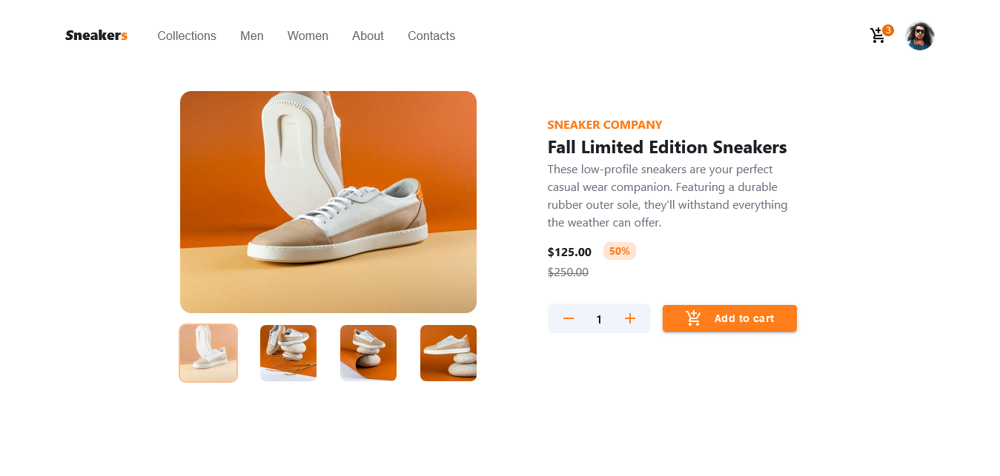

# Shopping Cart

 

 

   &nbsp;&nbsp;&nbsp;
  <!-- Status -->
   &nbsp;&nbsp;&nbsp;

  <!-- Difficulty -->
  

## **Preview**

    

 

## **Links**

  |                |                                                                      |
  | :------------- | :------------------------------------------------------------------- |
  | Solution URL:  | [https://github.com/syjem/shopping-cart](https://github.com/syjem/search)   |
  | Live Site URL: | [https://shopping-cart-9r2.pages.dev/](https://shopping-cart-9r2.pages.dev/) |
  |                |                                                                      |

 

## **Built With**

 &nbsp;  &nbsp;  &nbsp;  &nbsp; 

 